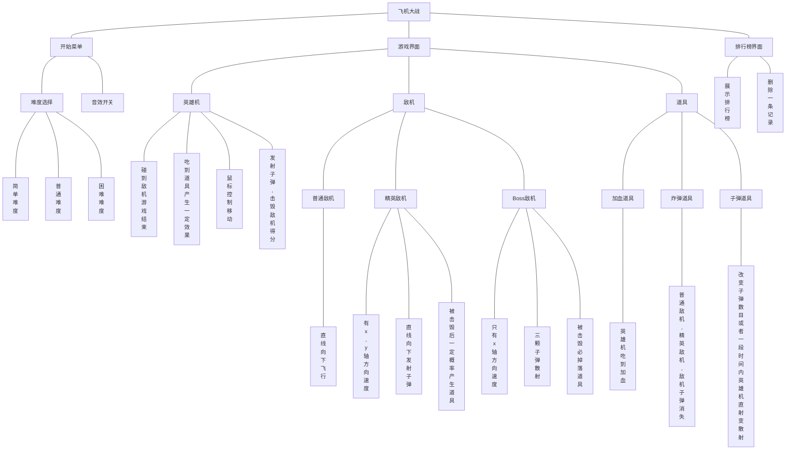

# AircraftWar
## java面向对象实验
- 功能层次图

```mermaid
graph TD
AircraftWar[飞机大战] --- StartUp[开始菜单]
AircraftWar --- Game[游戏界面]
AircraftWar --- Ranking[排行榜界面]

StartUp --- Difficulty[难度选择]
StartUp --- Sound[音效开关]


Difficulty --- EasyGame[简<br>单<br>难<br>度]
Difficulty --- CommonGame[普<br>通<br>难<br>度]
Difficulty --- HardGame[困<br>难<br>难<br>度]

Game --- Hero[英雄机]
Game --- Enemy[敌机]
Game --- Prop[道具]

Hero --- CrashEnemy[碰<br>到<br>敌<br>机<br>游<br>戏<br>结<br>束]
Hero --- CrashProp[吃<br>到<br>道<br>具<br>产<br>生<br>一<br>定<br>效<br>果]
Hero --- HeroMovement[鼠<br>标<br>控<br>制<br>移<br>动]
Hero --- ShootEnemy[发<br>射<br>子<br>弹<br>,<br>击<br>毁<br>敌<br>机<br>得<br>分]

Enemy --- MobEnemy[普通敌机]
Enemy --- EliteEnemy[精英敌机]
Enemy --- Boss[Boss敌机]

MobEnemy --- MobMovement[直<br>线<br>向<br>下<br>飞<br>行]

EliteEnemy --- EliteMovement[有<br>x<br>,<br>y<br>轴<br>方<br>向<br>速<br>度]
EliteEnemy --- Eliteshoot[直<br>线<br>向<br>下<br>发<br>射<br>子<br>弹]
EliteEnemy --- EliteDropProp[被<br>击<br>毁<br>后<br>一<br>定<br>概<br>率<br>产<br>生<br>道<br>具]

Boss --- BossMovement[只<br>有<br>x<br>轴<br>方<br>向<br>速<br>度]
Boss --- BossShoot[三<br>颗<br>子<br>弹<br>散<br>射]
Boss --- BossDropProp[被<br>击<br>毁<br>必<br>掉<br>落<br>道<br>具]

Prop --- BloodProp[加血道具]
Prop --- BombProp[炸弹道具]
Prop --- BulletProp[子弹道具]

BloodProp --- IncreaseHP[英<br>雄<br>机<br>吃<br>到<br>加<br>血]
BombProp --- Boom[普<br>通<br>敌<br>机<br>,<br>精<br>英<br>敌<br>机<br>,<br>敌<br>机<br>子<br>弹<br>消<br>失]
BulletProp --- ShootChange[改<br>变<br>子<br>弹<br>数<br>目<br>或<br>者<br>一<br>段<br>时<br>间<br>内<br>英<br>雄<br>机<br>直<br>射<br>变<br>散<br>射]

Ranking --- ShoeRnking[展<br>示<br>排<br>行<br>榜]
Ranking --- DeleteRanking[删<br>除<br>一<br>条<br>记<br>录]
```

